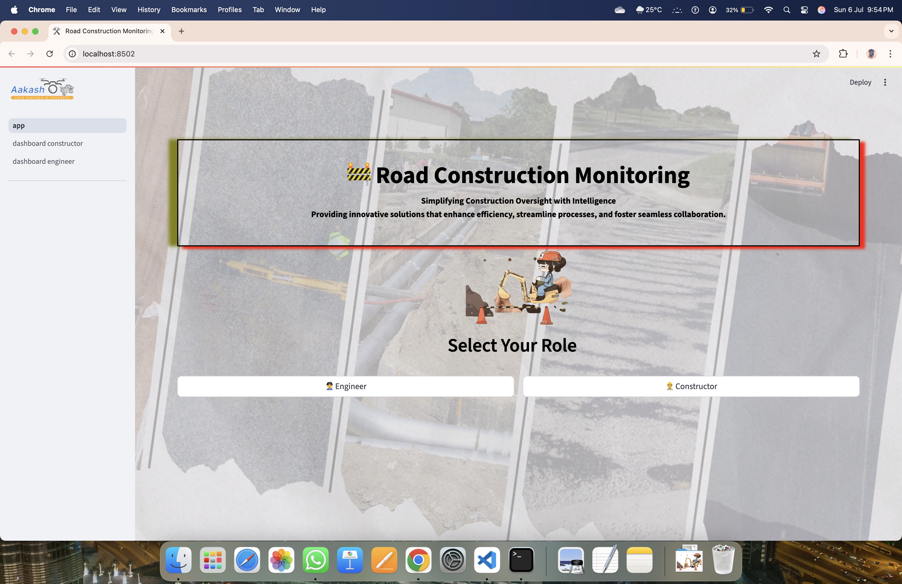
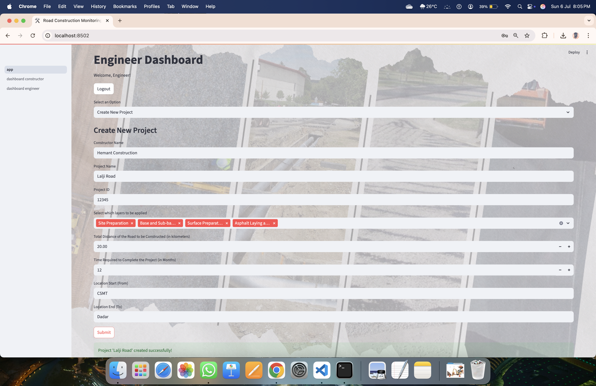
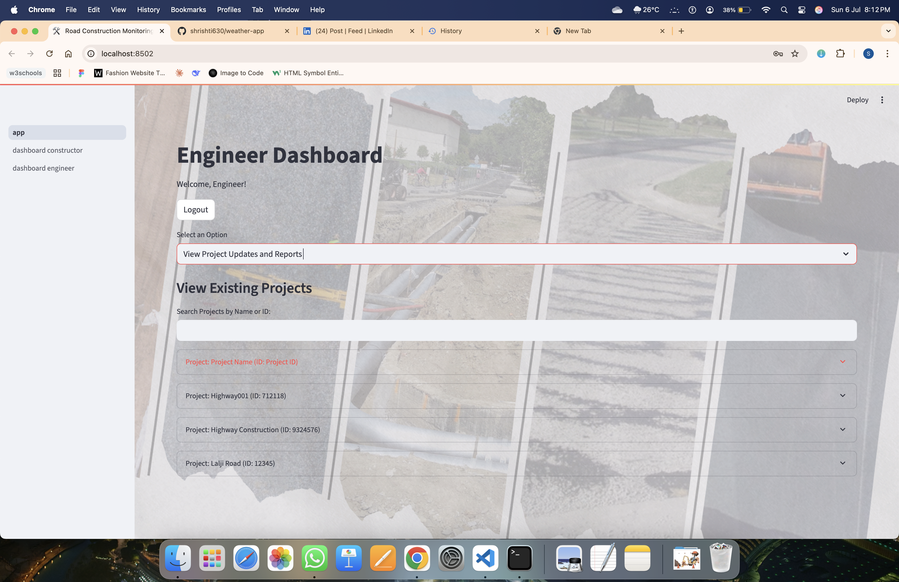
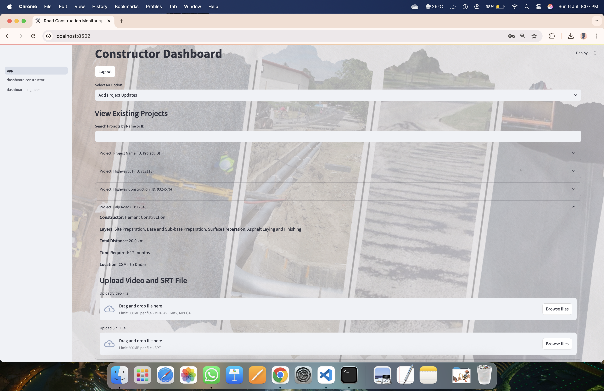
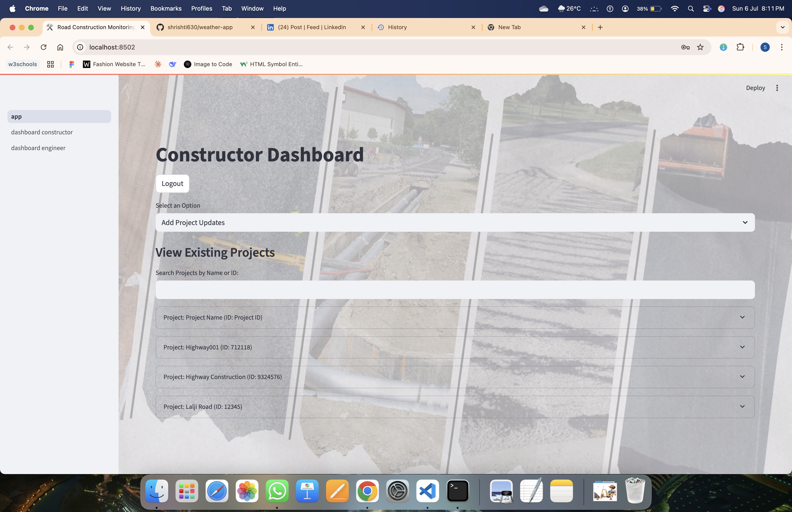
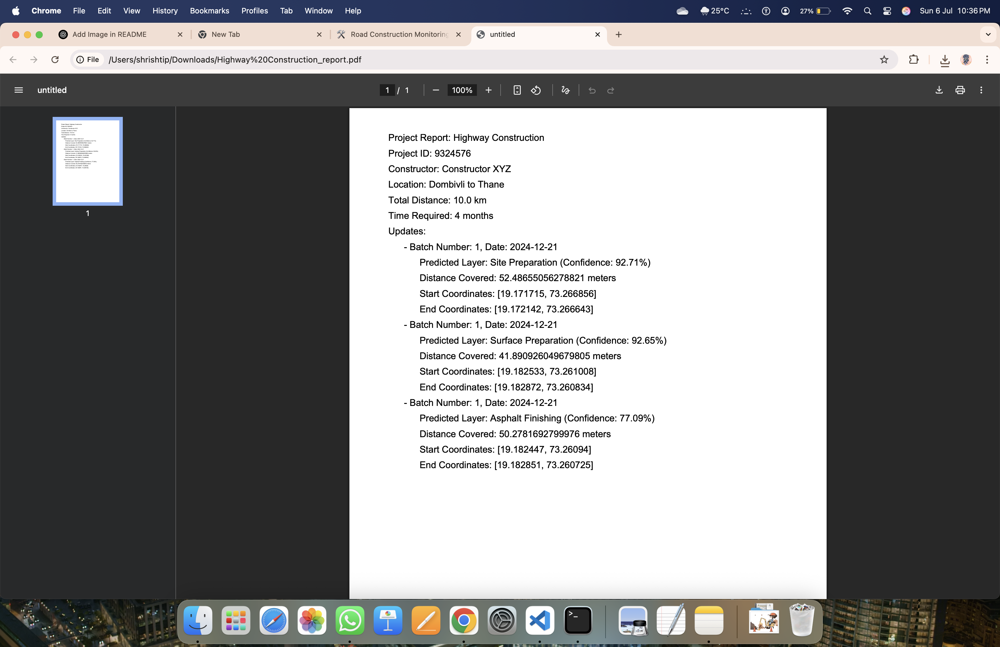

> 📌 **As referenced in my [LinkedIn post](https://www.linkedin.com/posts/akshata-bagul-61154b260_sih2024-smartindiahackathon-innovation-activity-7278781204072402944-QATE?utm_source=share&utm_medium=member_desktop&rcm=ACoAAEwcEj0Bzx1ARDTG3A_Jfml3fzid0vWmMJI)**


# Road Construction Progress Monitoring System

This project provides a web-based application to monitor road construction progress. The system uses AI-based image analysis, GPS coordinates validation, and a robust database to manage and track construction updates for different road layers. Built with **Streamlit**, the tool offers constructors and engineers a user-friendly interface to upload project updates and view detailed analytics.

---

## Features

### Constructor Features
1. **Upload Video and SRT Files**:
   - Extract representative frames from uploaded videos.
   - Parse SRT files to retrieve GPS coordinates.
2. **Layer Prediction**:
   - Use AI-based models to predict the construction layer (e.g., site preparation, asphalt laying).
3. **Distance Calculation**:
   - Automatically calculate the distance covered in each batch using GPS coordinates.
4. **Sequential Validation**:
   - Ensure GPS coordinates follow a sequential order and avoid repetition of previous data.
5. **Dynamic Frame Naming**:
   - Save extracted frames dynamically based on batch number and predicted layer.

### Engineer Features
1. **View Updates and Generate Reports**:
   - View detailed updates for each project, including layers, GPS coordinates, and batch information.
   - Generate PDF reports summarizing project progress.
2. **Analytics and Visualizations**:
   - **Cumulative Distance Coverage Over Time**: Track cumulative road distance progress.
   - **Confidence Distribution by Layer**: Analyze AI model accuracy for layer predictions.
   - **Batch-Wise Distance Coverage**: Visualize contributions of each batch to the project.
   - **Spatial Progress Map**: View construction progress geographically.

---

## Technologies Used

### Frontend
- **Streamlit**: For building the user interface.
- **Plotly**: For interactive visualizations.
- **Folium**: For mapping GPS coordinates.

### Backend
- **Python**: Core programming language.
- **PyTorch**: For AI model inference.
- **OpenCV**: For video processing and frame extraction.
- **Haversine**: For distance calculations using GPS coordinates.

### Database
- **JSON**: A lightweight database to store project and update data.

---

## How to Run

### Prerequisites
1. **Install Python** (>= 3.8): [Download Python](https://www.python.org/downloads/)
2. **Install Required Libraries**:
   ```bash
   pip install -r requirements.txt
   ```
   The `requirements.txt` file should contain:
   ```
   streamlit
   torch
   torchvision
   numpy
   pandas
   plotly
   folium
   haversine
   opencv-python
   reportlab
   matplotlib
   ```

### Steps to Run
1. **Clone the Repository**:
   ```bash
   git clone <repository_url>
   cd <repository_name>
   ```
2. **Run the Application**:
   ```bash
   streamlit run app.py
   ```
3. **Access the App**:
   - Open a browser and go to: `http://localhost:8501`

---

## Folder Structure
```
.
├── app.py                      # Main entry point for the application
├── pages/                      # Contains individual dashboard pages
│   ├── dashboard_constructor.py
│   ├── dashboard_engineer.py
├── utils/                      # Utility functions
│   ├── data_handler.py         # Functions to manage the database
│   ├── ui_helpers.py           # Helper functions for UI styling
├── models/                     # AI model files
│   ├── site_preparation.pth
│   ├── asphalt_finishing.pth
│   └── ...
├── screenshorts/   
│   ├── image1_home.png
│   ├── image2_engineer.png
│   └── ...      
├── assets/
│   ├── uploaded_images/        # Dynamically saved frames
├── uploads/                    # Temporary storage for uploaded files
├── data/
│   ├── database.json           # JSON database to store project data
├── requirements.txt            # List of required Python packages
├── README.md                   # Documentation (this file)
```

---

## How It Works

### Step 1: Constructor Workflow
1. The constructor logs in and selects a project.
2. They upload a video and an SRT file containing GPS metadata.
3. The app:
   - Extracts a frame from the video.
   - Parses the SRT file for start and end GPS coordinates.
   - Validates sequentiality and non-repetition of coordinates.
   - Predicts the layer using the AI model.

### Step 2: Engineer Workflow
1. The engineer logs in and selects a project to view updates.
2. The system provides:
   - Batch-level details for each update.
   - Visualizations of progress and predictions.
   - A spatial map showing progress on the ground.

---

## AI Model and Theory

1. **Layer Prediction**:
   - ResNet18 model fine-tuned for road construction tasks.
   - Five categories for prediction: site preparation, base/sub-base preparation, utility ducts, surface preparation, and asphalt finishing.

2. **GPS Validation**:
   - The system validates GPS sequentiality using the **Haversine formula** to calculate distances.
   - Ensures no duplicate or inconsistent updates for the same layer.

3. **Frame Extraction**:
   - Extracts a representative frame from the middle of the video for analysis using **OpenCV**.

---

## 🔍 Screenshots

### 🏠 Home Page


### 📤 Upload Interface (Engineer)



### 📤 Upload Interface (Constructor)



### 📄 Engineer Report Dashboard


---
## Troubleshooting

1. **File Not Found Errors**:
   - Ensure directories (`uploads`, `data`, `assets/uploaded_images`) are created before running the app.
2. **Duplicate Updates**:
   - The app validates GPS and layer sequentiality, but manual checks might be needed for accuracy.
3. **Dependency Issues**:
   - Reinstall dependencies using `pip install -r requirements.txt`.

---

## Future Improvements
- Integration with cloud storage for video and frame management.
- Advanced AI models for better prediction accuracy.
- Real-time GPS validation during data entry.

---

## License
This project is licensed under the MIT License.

---

